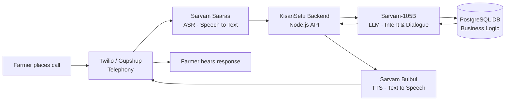

# KisanSetu 🌾

**AI & Voice-Enabled Market Intelligence and Farmer–Buyer Linkage Platform**

Built for **SIH26132** — Strengthening market linkages and price discovery for farmers
*(Theme: Agriculture, FoodTech & Rural Development)*


---

## Overview

KisanSetu is a **web-first (PWA)** platform that gives farmers real-time, multi-market price visibility, AI-driven advice on *when* to sell, verified-buyer matching, AI-assisted price negotiation within farmer-set bounds, and secure escrow-backed payments — made fully accessible to low-literacy, low-smartphone-access farmers through a **voice agent powered by Sarvam AI** (in-browser and phone-call based). No native app required.

**[Live Demo](#) · [Pitch Deck](#) · [Full Solution Doc](docs/architecture.md)**

---

## Key Features

- 📊 **Price Intelligence** — live mandi/e-NAM price aggregation with trend charts
- 🤖 **AI Sale-Window Advisory** — "sell now / wait / store" recommendations
- 🤝 **AI Negotiation Agent** — auto-bargains with buyers within farmer-set price bounds
- 🌾 **FPO Pooling** — combine smallholder produce for stronger bargaining power
- 📸 **AI Quality Grading** — photo-based produce grading
- 🔒 **Escrow Payments & Transparent Ledger** — payment held until delivery confirmed
- 🗣️ **Voice Agent (Sarvam AI)** — full conversational access via web or phone call, in 10+ Indian languages
- 🪪 **Compliant Identity Verification** — tokenized, encrypted Aadhaar/PAN/KCC handling

Full feature list → [`docs/features.md`](docs/features.md)

---

## Architecture



*Full layered system architecture (Access → Application → AI/Voice → Data layers) → [`docs/architecture.md`](docs/architecture.md)*

---

## Tech Stack

| Layer | Technology |
|---|---|
| Frontend | Next.js (React) PWA, Tailwind CSS |
| Backend API | Node.js (Express/NestJS) |
| Database | PostgreSQL + TimescaleDB, Redis (caching) |
| AI/ML | Python FastAPI — Prophet (forecasting), TensorFlow.js (quality grading) |
| Voice & Language AI | **Sarvam AI** (Saaras ASR, Sarvam-105B LLM, Bulbul TTS) + Twilio/Gupshup |
| Auth | OTP (Twilio Verify / MSG91) |
| Payments | Razorpay (escrow, test mode for prototype) |
| Hosting | Vercel (frontend), Render (backend/AI/voice services), Supabase (DB) |

---

## Project Structure

```
kisansetu/
├── apps/
│   ├── web/            # Next.js PWA
│   ├── api/             # Node.js backend
│   └── voice-gateway/    # Sarvam AI voice pipeline
├── services/ai-engine/  # Python FastAPI ML services
├── packages/            # Shared types, UI, config
├── docs/                 # Full documentation (see below)
└── data/seed/            # Pre-seeded real mandi price data
```

Full structure with explanations → [`docs/file-structure.md`](docs/file-structure.md)

---

## Getting Started

### Prerequisites
- Node.js ≥ 18, npm or pnpm
- Python ≥ 3.10
- PostgreSQL (or a free Supabase project)
- API keys: Sarvam AI, Twilio/Gupshup, Razorpay (test mode), Agmarknet/data.gov.in

### Installation
```bash
git clone https://github.com/<your-org>/kisansetu.git
cd kisansetu
npm install          # installs all workspace packages
cp .env.example .env  # then fill in your API keys
```

### Running locally
```bash
# Frontend (apps/web)
npm run dev --workspace=apps/web

# Backend API (apps/api)
npm run dev --workspace=apps/api

# AI engine (services/ai-engine)
cd services/ai-engine && pip install -r requirements.txt && uvicorn app.main:app --reload

# Voice gateway (apps/voice-gateway)
npm run dev --workspace=apps/voice-gateway
```

### Environment Variables
See [`.env.example`](.env.example) for the full list, including:
```
DATABASE_URL=
SARVAM_API_KEY=
TWILIO_ACCOUNT_SID=
TWILIO_AUTH_TOKEN=
RAZORPAY_KEY_ID=
RAZORPAY_KEY_SECRET=
AGMARKNET_API_KEY=
```

---

## Documentation

| Doc | Contents |
|---|---|
| [`docs/architecture.md`](docs/architecture.md) | Full system architecture, problem-statement alignment, module breakdown |
| [`docs/features.md`](docs/features.md) | Complete feature list by category |
| [`docs/voice-agent-flows.md`](docs/voice-agent-flows.md) | Sarvam AI pipeline details, per-intent conversation flows |
| [`docs/compliance-aadhaar-dpdp.md`](docs/compliance-aadhaar-dpdp.md) | Aadhaar/PAN/KCC tokenization design, DPDP Act alignment |
| [`docs/data-sources.md`](docs/data-sources.md) | Real vs. simulated data sources used |
| [`docs/risks-and-roadmap.md`](docs/risks-and-roadmap.md) | Known limitations, mitigations, future extensions |

---

## Team

**Team Name:** [Your Team Name]
**Team ID:** [Your Team ID]

## License

This project is submitted for Smart India Hackathon 2026 (SIH26132). Licensed under MIT unless stated otherwise — see [`LICENSE`](LICENSE).

## Acknowledgements

- Price data: [Agmarknet / data.gov.in](https://data.gov.in), [e-NAM](https://enam.gov.in), [UPAg](https://upag.gov.in)
- Voice AI: [Sarvam AI](https://sarvam.ai)
